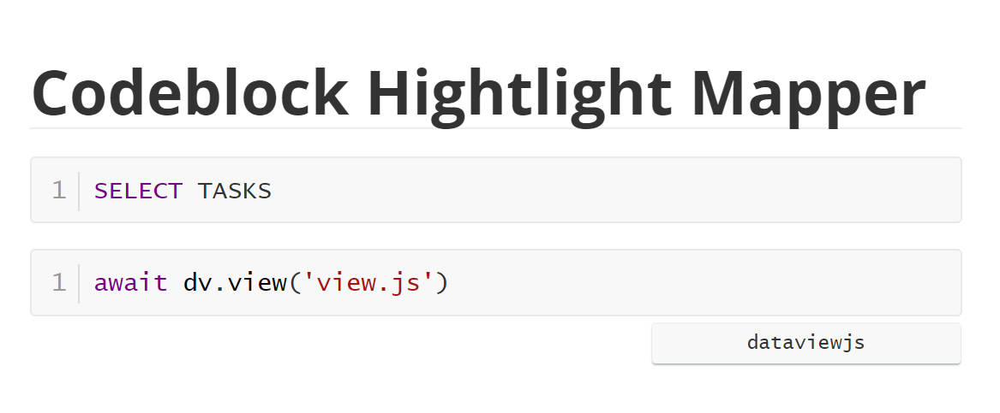

# Typora Plugin Codeblock Hightlight Mapper

[English](./README.md) | 简体中文

这是一个基于 [typora-community-plugin][core] 开发的，适用于 [Typora](https://typora.io) 的插件。

为了高亮不支持的语言，可以根据配置将语言 A 映射为语言 B，以使用语言 B 的语法高亮。

## Preview

## 安装

1. 安装 [typora-community-plugin][core]
2. 在 “设置 -> 插件市场” 中搜索 “Codeblock Hightlight Mapper” 并安装

[core]: https://github.com/typora-community-plugin/typora-community-plugin
